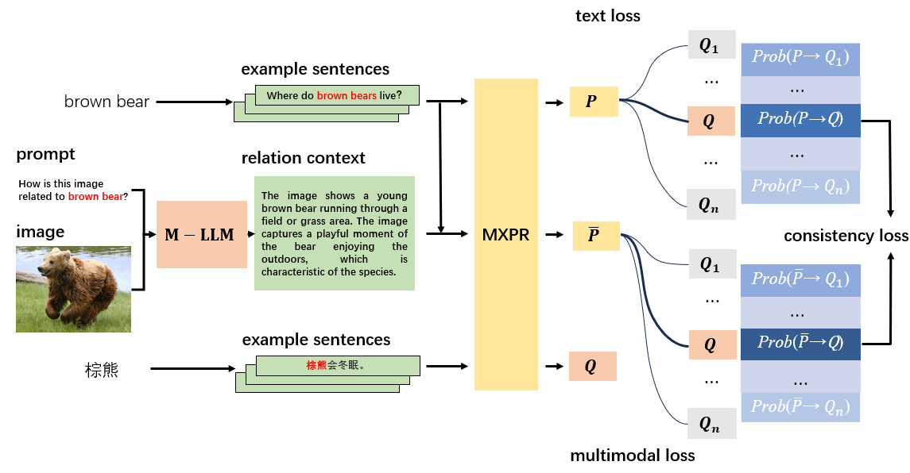

# Multimodal Cross-lingual Phrase Retrieval
This repository contains the code and pre-trained models for our paper Multimodal Cross-lingual Phrase Retrieval.

**************************** **Updates** ****************************

- 2/16 Our paper has been accepted to **LREC-COLING 2024**.

## Overview

We propose a method for retrieving parallel phrases across languages from multimodal data, termed Multimodal Cross-lingual Phrase Retrieval.



## Dataset

<!-- ## Anatation rules:


-->


## Getting Started
In the following sections, we describe how to use our MXPR.
### Requirements
- First, install PyTorch by following the instructions from [the official website](https://pytorch.org). To faithfully reproduce our results, please use the correct `torch==1.8.1+cu111` version corresponding to your platforms/CUDA versions. PyTorch version higher than `1.8.1` should also work. 
- Then, run the following script to fetch the repo and install the remaining dependencies.
```bash
git clone https://github.com/sdongchuanqi/MXPR.git
cd MXPR
pip install -r requirements.txt
mkdir data
mkdir model
mkdir result
```
### Dataset

Before using MXPR, please process the dataset by following the steps below.

- Download Our Dataset Here: [link]()

- Unzip our dataset and move dataset into data folder. (Make sure the path in bash file is the path of dataset)

- Get relation text from m-plug [link](https://github.com/X-PLUG/mPLUG-Owl/tree/main/mPLUG-Owl)

- We alse offer our labeled Here: [link]()

### checkpoint 
链接：https://pan.baidu.com/s/1QQ6eRMkLNJAzr75VoZm7dg 
提取码：0enw
  
### Train MXPR
<!-- Download XLMR checkpoint from Huggingface page: [link](https://huggingface.co/xlm-roberta-base). -->
```
bash train.sh
```


